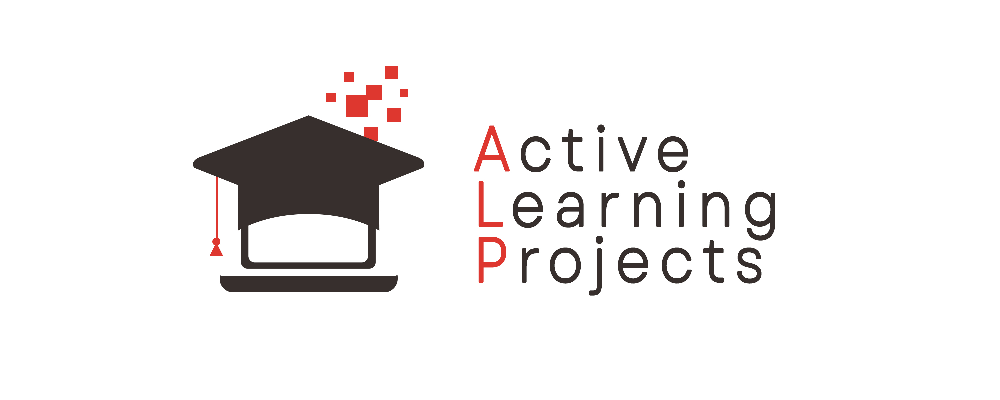

# Active Learning Project



## Active Learning project mission
The ALP mission is to provide a blueprint for a better internet and empower a new generation of developers.

## Build the site
To set up the site locally, you need to have [Node.js](https://nodejs.org/en/)  and Yarn installed. You can check if these are installed by running the following commands:

```
node -v


yarn -v
```

After you have installed Node.js and Yarn, you can install the dependencies using yarn and start the local preview:
```
yarn

yarn start
```

Once started, a live preview is available at http://localhost:4200/.

## Contribute to Active Learning Project
You can contribute to Active Learning Project and be a part of our community through content contributions, engineering, or translation work.

 The Active Learning Project welcomes contributions from everyone who shares our goals and wants to contribute constructively and respectfully within our community.

 To find out how to get started, see the [CONTRIBUTING.md](CONTRIBUTION.md) document in this repository. By participating in and contributing to our projects and discussions, you acknowledge that you have read and agree to our [Code of Conduct](toAdd).